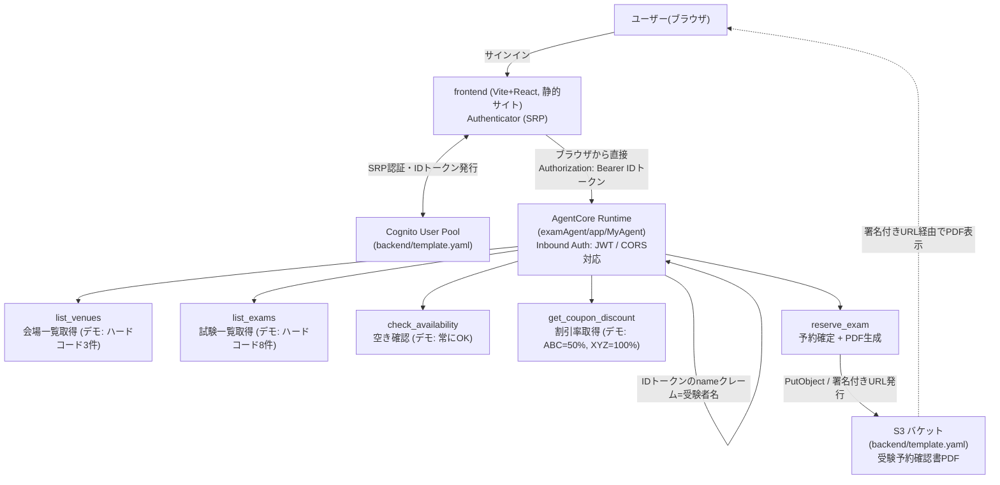

# 認定試験 受験予約エージェント (cert_exam_agent)

認定試験の受験予約を、チャットで行える AI エージェントアプリケーションです。ユーザーはサインインして、
「受験日時・試験名・会場名・クーポンコード」をチャットで伝えるだけで受験予約が完了し、受験予約確認書
PDF をダウンロードできます。

## 全体構成

このリポジトリは3つのサブプロジェクトからなるモノリポです。

```
cert_exam_agent/
├── backend/     ... AWS SAM: 認証(Cognito) と PDF格納用 S3 バケットを構築
├── examAgent/   ... Amazon Bedrock AgentCore Runtime 上で動く Strands Agent(エージェント本体)
├── frontend/    ... Vite + React: サインインしてエージェントとチャットする Web UI
└── amplify.yml  ... frontend を AWS Amplify Hosting にモノリポとしてデプロイするためのビルド設定
```

### 全体の関連図



フロントエンドはサーバー側プロキシを介さず、**ブラウザから AgentCore Runtime を直接呼び出します**
（AgentCore Runtime は CORS に対応しているため）。`frontend` は Vite でビルドした素の静的サイトとして
AWS Amplify Hosting にデプロイされ、サーバー機能（SSR/API Routes）は一切使いません。

3つのサブプロジェクトは互いに直接参照し合わず、**設定値（バケット名、Cognito の ID など）を介して
結び付いて**います。それぞれのデプロイ・設定手順は各フォルダの README を参照してください。

### なぜ Next.js を断念し Vite に切り替えたのか

`frontend` は当初 Next.js で実装していたが、AWS Amplify Hosting へのデプロイで次の問題が段階的に
発生し、最終的に Next.js の採用を断念して Vite + React に切り替えた。

**1. サーバー側プロキシのストリーミングが動かない**

最初の実装は、Next.js の API Route（サーバー側）で AgentCore Runtime を呼び出し、その
ストリーミング応答（SSE）をブラウザへ中継する構成だった。これは「ブラウザから直接 AWS の
エンドポイントを呼ぶと CORS で失敗するはず」という未検証の前提に基づく設計だった。

実際に Amplify Hosting へデプロイしたところ、API Route が 500 エラーで失敗した。調査した結果、
**AWS Amplify Hosting の Next.js SSR compute は、API Route からのストリーミングレスポンス
（`ReadableStream`）をサポートしていない**ことが判明した（AWS公式ドキュメントの
[Amplify support for Next.js](https://docs.aws.amazon.com/amplify/latest/userguide/ssr-amplify-support.html)
の Unsupported features に明記。ローカル開発環境や `next start` では問題なく動作するため、
Amplify Hosting にデプロイするまで発覚しなかった）。

**2. CORS の前提を検証し直し、静的サイト化**

そこで、そもそもサーバー側の中継が必要かどうかを検証した。AgentCore Runtime のエンドポイントに対して
実際に CORS プリフライトリクエスト（`OPTIONS`）を送ったところ、`Access-Control-Allow-Origin: *`
などが返り、**ブラウザから直接呼び出せることが確認できた**。この結果を踏まえ、サーバー側プロキシを
廃止してブラウザから直接呼び出す構成に変更し、Next.js を `output: "export"`（静的サイト生成）に
変更した。

**3. Amplify のフレームワーク自動検出が Next.js を常に SSR と判定する**

しかし、Amplify Hosting のアプリ作成ウィザードは `package.json` の内容から Next.js を検出すると、
`amplify.yml` のビルド設定（`baseDirectory: out` など）とは無関係に「SSR (Web Compute)」のデプロイ
パイプラインを自動的に選んでしまう。ビルド自体は静的サイトとして完全に成功していても、Amplify 側の
デプロイ処理が SSR 用の成果物（`required-server-files.json`）を要求し、それが存在しないため
`CustomerError: Can't find required-server-files.json` で失敗した。

回避策としては `aws amplify update-app --platform WEB` でプラットフォームを明示的に固定する方法が
あるが、アプリを作成し直すたびに手動介入が必要になり、運用上の複雑さが増大した。

**結論: Vite への切り替え**

このアプリはブラウザから直接 AgentCore Runtime を呼ぶため、そもそもサーバー機能（SSR/API Routes）を
一切必要としていない。Next.js を使う理由自体がなくなっていた。Vite は最初から素の静的ファイル
（HTML/CSS/JS）を出力するだけのビルドツールで、サーバー機能を持たないため、Amplify Hosting から
常に静的サイト（WEB platform）として認識される。ストリーミング表示・認証UI
（`@aws-amplify/ui-react` の `Authenticator`）といった要件はそのまま維持しつつ、Next.js 特有の
自動検出問題を構造的に回避できるため、`frontend` を Vite + React + TypeScript に置き換えた。

## サブプロジェクトの役割

### backend/ — AWS SAM (認証・ストレージ基盤)

`backend/template.yaml` が定義する、エージェントとフロントエンドの両方が使う基盤リソースです。

- **S3 バケット**: エージェントが生成する受験予約確認書 PDF の格納先。パブリックアクセスは禁止し、
  ダウンロードは署名付き URL 経由のみ。一定期間後に自動削除。
- **Cognito User Pool / User Pool Client**: フロントエンドのサインイン用。メールアドレスでサインイン
  し、`name`属性（受験者名）の入力を必須にしている。認証方式は Amplify UI + SRP（Hosted UI は使わない）。
- **IAM Managed Policy**: エージェントの実行ロールに付与する、S3 バケットへの `PutObject`/`GetObject`
  権限。

`backend` の SAM デプロイで得られる Outputs（バケット名、Cognito の User Pool ID / Client ID /
discovery URL、ポリシー ARN）が、`examAgent` と `frontend` の設定値として使われます。

詳細は [`backend/README.md`](./backend/README.md) を参照してください。

### examAgent/ — AgentCore Runtime (エージェント本体)

Amazon Bedrock AgentCore Runtime 上で動く Strands Agent です。`agentcore` CLI で作成・デプロイされた
プロジェクトで、エントリポイントは `examAgent/app/MyAgent/main.py` です。

- **受験者名の解決**: サインインユーザーの Cognito ID トークン（`Authorization` ヘッダー経由でエージ
  ェントに転送される）から `name` クレームを読み取り、受験者名として使用する。ユーザーに名前を聞かない。
- **5つのツール**（`app/MyAgent/skills/reservation.py`）:
  - `list_venues` — 試験会場の一覧を返す（デモ実装: ハードコードされた3会場）
  - `list_exams` — 受験可能な認定試験の一覧を返す（デモ実装: ハードコードされたAWS認定8種）
  - `check_availability` — 日時・試験名・会場名から空きを確認（デモ実装: 常に `OK`）
  - `get_coupon_discount` — クーポンコードから割引率を返す（デモ実装: `ABC`→50%, `XYZ`→100%）
  - `reserve_exam` — 予約を確定し、日本語フォント埋め込みの PDF を生成して S3 に格納、署名付き URL
    を返す
- **AgentCore Memory**: セッションごとの会話履行を保持する。
- **Inbound Auth (CUSTOM_JWT)**: `backend` で作成した Cognito の discovery URL / audience を使い、
  JWT（ID トークン）を検証する。`agentcore/agentcore.json` に設定されている。

詳細は [`examAgent/README.md`](./examAgent/README.md) と [`examAgent/AGENTS.md`](./examAgent/AGENTS.md)
を参照してください。

### frontend/ — Vite + React (Web UI)

サインインしてエージェントとチャットするための Web アプリケーションです。素の静的サイトとして
ビルドされ、サーバー機能は使いません（Next.js を採用していた経緯と断念した理由は上記参照）。

- **認証**: `@aws-amplify/ui-react` の `Authenticator` コンポーネントで、SRP 認証によりサインイン/
  サインアップを行う（Cognito Hosted UI は使わない）。サインアップ時に受験者名（`name`属性）の入力を
  必須にしている。
- **チャット UI**: エージェントの応答を SSE (Server-Sent Events) でストリーミング表示する。ツール呼び
  出し中は「空き状況を確認しています...」のように状況を表示し、完了後は Markdown を HTML に変換して
  表示する。受験予約確認書 PDF の署名付き URL はクリックすると新しいタブで直接開く。
- **AgentCore Runtime への直接呼び出し**: ブラウザから AgentCore Runtime の `/invocations`
  エンドポイントへ直接 `fetch` する（`src/lib/agent-client.ts`）。AgentCore Runtime が
  `Access-Control-Allow-Origin: *` を返すため CORS の問題は起きない。呼び出しには Cognito が発行した
  JWT が必須のため、ARN がブラウザ側の JS に埋め込まれていても、それだけでは呼び出せない。

詳細は [`frontend/README.md`](./frontend/README.md) を参照してください。

## デプロイの順序

各サブプロジェクトは設定値を介して依存しているため、次の順序でデプロイします。

1. **backend** をデプロイし、S3 バケット名・Cognito の User Pool ID / Client ID / discovery URL・
   IAM ポリシー ARN を取得する（`sam deploy --guided`）。
2. **examAgent** の `agentcore/agentcore.json` に、1 で取得した値（バケット名を環境変数
   `EXAM_RESERVATION_BUCKET` に、Cognito の discovery URL / audience を Inbound Auth に、IAM ポリシー
   ARN を `additionalPolicies` に）を設定し、`agentcore deploy` でエージェントをデプロイする。
3. **frontend** の環境変数（`.env.local`、Amplify Hosting ではコンソールの環境変数。すべて
   `VITE_` 付き）に、1 で取得した Cognito の値と、2 で取得した AgentCore Runtime の
   ARN・リージョンを設定してデプロイする（`amplify.yml` を使ったモノリポ構成、`appRoot: frontend`、
   静的サイトとしてビルド）。

## 技術スタック

| サブプロジェクト | 主な技術 |
| --- | --- |
| backend | AWS SAM, Amazon Cognito, Amazon S3, IAM |
| examAgent | Amazon Bedrock AgentCore Runtime, Strands Agents SDK (Python), AgentCore Memory, reportlab (PDF生成) |
| frontend | Vite + React + TypeScript, aws-amplify / @aws-amplify/ui-react, react-markdown |
